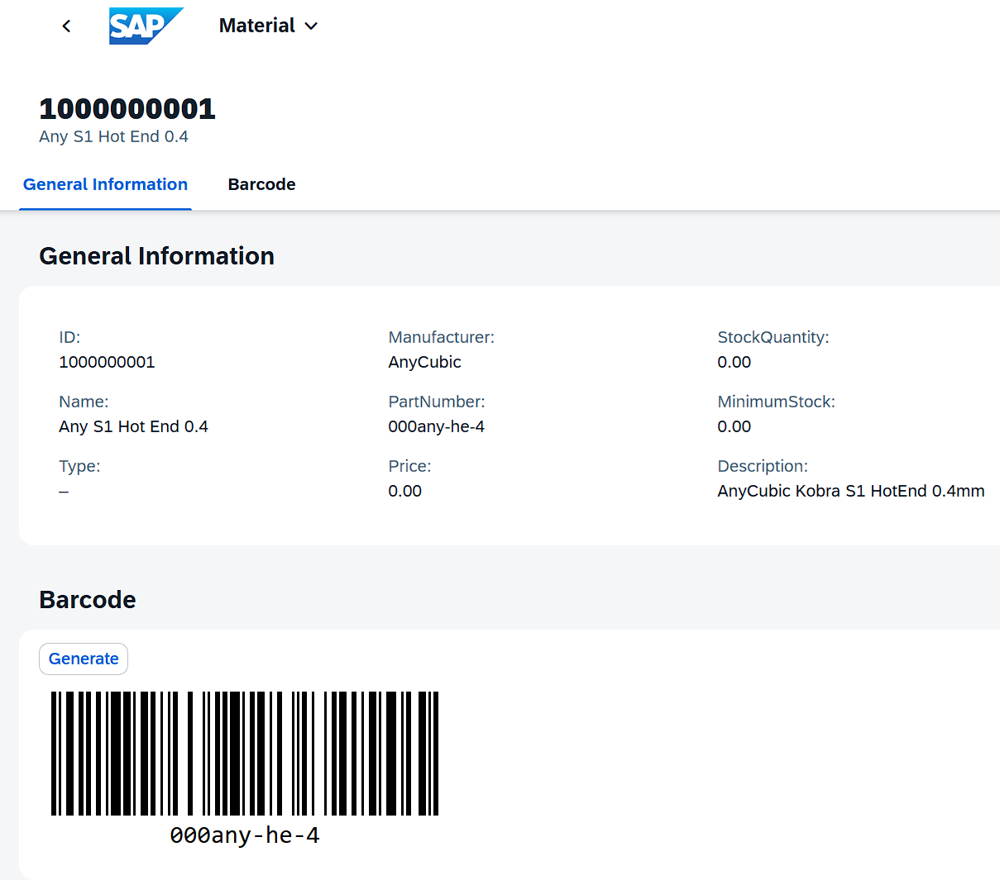

# 3D Printer Materials

Components and Tools of 3D Printers.

## Features

* TypeScript
* Fiori Elements OData V4 with extensions 
* Controller extension (`controller.ts`) for given Entity/Object Page only
* re-declare module 'sap/ui/core/mvc/ControllerExtension' for easier inheritance in TS
* Custom subsection fragments and event handlers, where handler is loaded with `core:require` inside the fargment, not that not on the fragment level, but inside the content
* manifest.json configuration `(".extension...")` to use controller extension ( `controller.ts` ) as EventHandler for custom actions (instead of generated handler SomeName.ts )
* Barcode rendering upon action
* Opening a dialog fragment and rendering Barcode inside the dialog

## Backend

[OData V4, RAP, Late Numbering](https://github.com/attilaberencsi/zsapdev_agit/tree/cloud/src/zsapdev_rap_sample/zsapdev_sample_rap_3d_print)

## Shots

